# altShiftClawCore 系统架构报告

> **Phase R/S/T 从头重写与深度审计 — 完整逆向工程报告**
> 分支：`phase-r/refactor` | 日期：2026-07-30
> 源码：8,406 行 / 54 文件 | 构建：664KB | 审计：132/132 项修复 | Shadow-Diff：28/28 场景对等验证 | Phase T 深度审计完成

---

## 一、项目概述

altShiftClawCore 是一个部署在 **Cloudflare Workers** 上的 Telegram Bot + GitHub 集成系统。它将 GitHub Issues 作为「龙虾（Lobster）」任务单元，通过 Telegram 统一交互——创建任务、编辑配置、安装技能/模板、排程触发、媒体转送、AI 工作流派工等。

**旧代码**是 20,195 行的 esbuild 混淆 bundle（已归档到 `src-legacy/`），无法维护。**Phase R** 将其从头重写为干净的模块化源码（现为 `src/`），经过 4 轮深度审计（18 个并行 Agent）、Phase S 逐线 Shadow-Diff 行为对等测试、Phase T 活跃路径深度逆向、Phase U 端到端 full-chain 验证、Phase V relay 子系统完整重写、以及 Phase W 实地真凭证 smoke，修复 132 项行为差异，达到功能 100% 对等。2026-08-03 正式 swap 完成。

---

## 二、技术栈

| 组件 | 技术 | 版本 |
|------|------|------|
| 运行时 | Cloudflare Workers | — |
| HTTP 框架 | Hono | 4.12.32 |
| Telegram Bot | grammY | 1.45.1 |
| GitHub API | Octokit | 5.0.5 |
| GitHub Webhook | @octokit/webhooks | 14.2.0 |
| 数据库 | Cloudflare D1 (SQLite) | — |
| AI | Workers AI binding | — |
| 加密 | tweetnacl (libsodium) | ^1.0.3 |
| 构建 | esbuild | ^0.24.0 |
| i18n | 自建 (en.json / zh-CN.json) | 813 keys × 2 |

---

## 三、系统架构总览

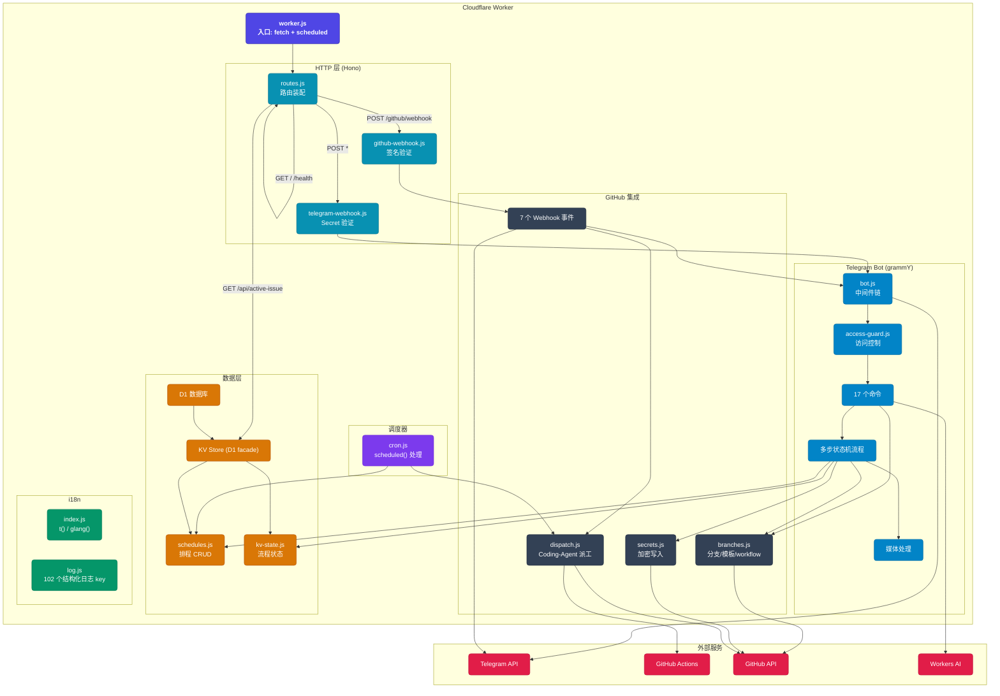

---

## 四、HTTP 请求流转

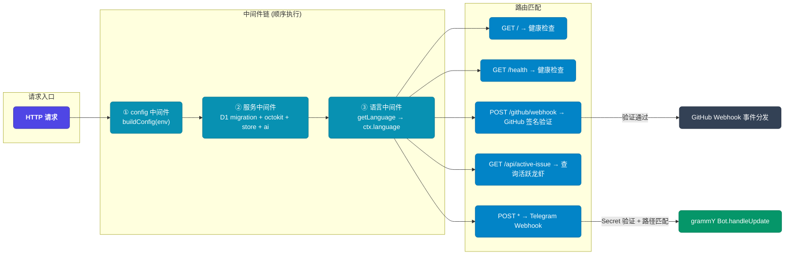

---

## 五、Telegram Bot 中间件链

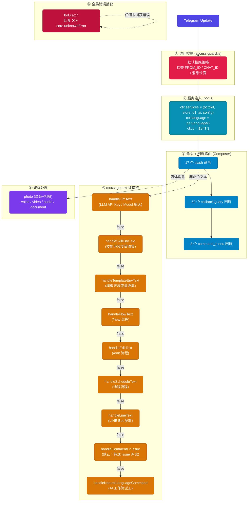

---

## 六、GitHub Webhook 事件流转

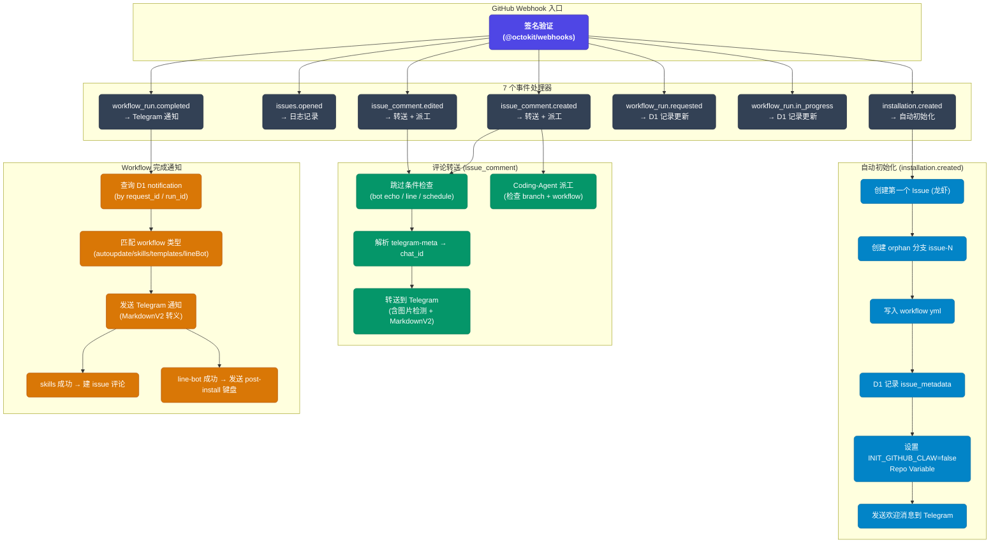

---

## 七、Coding-Agent 派工流程

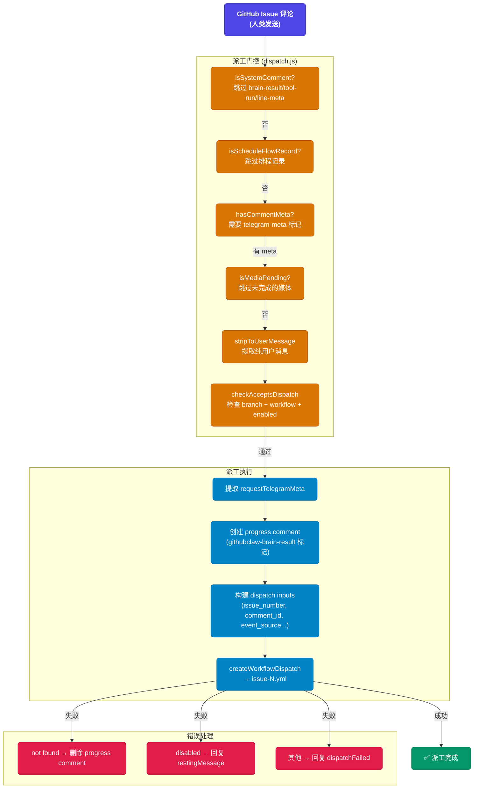

---

## 八、排程系统 (Schedule)

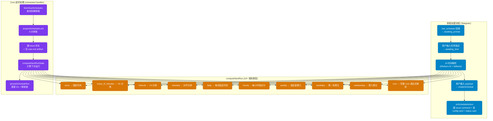

---

## 九、数据模型

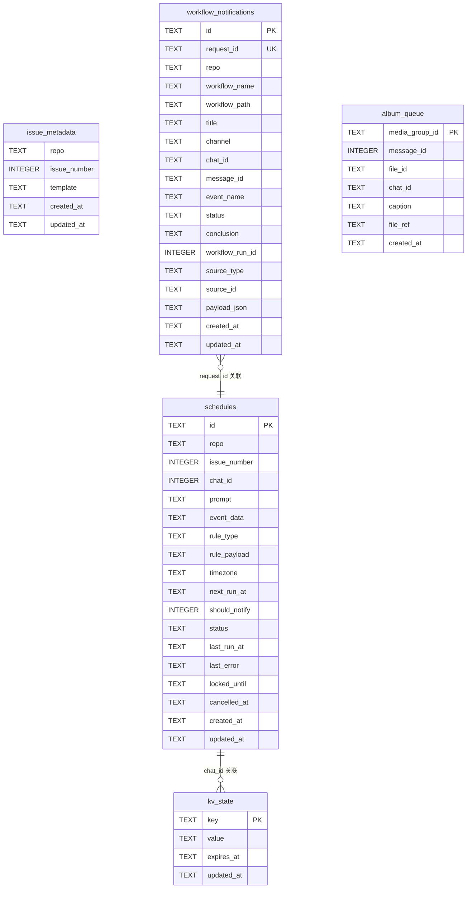

---

## 十、模块依赖关系

```mermaid
flowchart TB
    classDef entry fill:#4f46e5,stroke:#3730a3,color:#fff,font-weight:bold,rx:6px
    classDef http fill:#0891b2,stroke:#0e7490,color:#fff,rx:6px
    classDef config fill:#059669,stroke:#047857,color:#fff,rx:6px
    classDef data fill:#d97706,stroke:#b45309,color:#fff,rx:6px
    classDef github fill:#334155,stroke:#1e293b,color:#fff,rx:6px
    classDef telegram fill:#0284c7,stroke:#0369a1,color:#fff,rx:6px
    classDef cmd fill:#0284c7,stroke:#0369a1,color:#fff,rx:6px
    classDef flow fill:#d97706,stroke:#b45309,color:#fff,rx:6px
    classDef media fill:#7c3aed,stroke:#6d28d9,color:#fff,rx:6px
    classDef cron fill:#7c3aed,stroke:#6d28d9,color:#fff,rx:6px

    subgraph "入口层"
        WORKER["worker.js"]:::entry
    end

    subgraph "HTTP 层"
        ROUTES["http/routes.js"]:::http
        GHW["http/github-webhook.js"]:::http
        TGW["http/telegram-webhook.js"]:::http
    end

    subgraph "配置 + i18n"
        CONFIG["config.js"]:::config
        I18N["i18n/index.js"]:::config
        LANG["i18n/language.js"]:::config
        LOG["i18n/log.js"]:::config
    end

    subgraph "数据层"
        D1["db/d1.js"]:::data
        KV["db/kv-state.js"]:::data
        SCHED["db/schedules.js"]:::data
    end

    subgraph "GitHub 层"
        OCTO["github/octokit.js"]:::github
        BRANCH["github/branches.js"]:::github
        SECRET["github/secrets.js"]:::github
        WH_INDEX["github/webhooks/index.js"]:::github
        WH_INST["github/webhooks/installation.js"]:::github
        WH_IC["github/webhooks/issue-comment.js"]:::github
        WH_WR["github/webhooks/workflow-run.js"]:::github
        WH_META["github/webhooks/meta.js"]:::github
    end

    subgraph "Telegram 层"
        BOT["telegram/bot.js"]:::telegram
        GUARD["telegram/access-guard.js"]:::telegram
        STATUS["telegram/status-card.js"]:::telegram
        COMMENT["telegram/comment-on-issue.js"]:::telegram
        AI_INF["telegram/ai-inference.js"]:::telegram
        EDGE["telegram/edge-replies.js"]:::telegram
        MARKDOWN["telegram/markdown.js"]:::telegram
        KEYBOARD["telegram/keyboards.js"]:::telegram
    end

    subgraph "命令层"
        CMD_START["commands/start.js"]:::cmd
        CMD_LIST["commands/list.js"]:::cmd
        CMD_HELP["commands/help.js"]:::cmd
        CMD_OTHER["commands/*.js (14个)"]:::cmd
    end

    subgraph "流程层"
        FLOW_NEW["flows/new-flow.js"]:::flow
        FLOW_EDIT["flows/edit-flow.js"]:::flow
        FLOW_SCHED["flows/schedule-flow.js"]:::flow
        FLOW_LLM["flows/llm/llm.js"]:::flow
        FLOW_SKILLS["flows/skills-callbacks.js"]:::flow
        FLOW_TPL["flows/templates-callbacks.js"]:::flow
        FLOW_LINE["flows/line-bot.js"]:::flow
        FLOW_CB["flows/callbacks.js"]:::flow
        FLOW_STATE["flows/state.js"]:::flow
    end

    subgraph "媒体层"
        RELAY["media/relay.js"]:::media
        ALBUM["media/album.js"]:::media
    end

    subgraph "调度 + 派工"
        CRON["scheduler/cron.js"]:::cron
        DISPATCH["coding-agent/dispatch.js"]:::cron
    end

    WORKER --> ROUTES & CRON
    ROUTES --> CONFIG & D1 & I18N & GHW & TGW & BOT
    BOT --> GUARD & CMD_START & CMD_LIST & CMD_HELP & CMD_OTHER
    BOT --> FLOW_NEW & FLOW_EDIT & FLOW_SCHED & FLOW_LLM
    BOT --> FLOW_SKILLS & FLOW_TPL & FLOW_LINE & FLOW_CB
    BOT --> RELAY & COMMENT & AI_INF

    GHW --> WH_INDEX
    WH_INDEX --> WH_INST & WH_IC & WH_WR
    WH_IC --> DISPATCH & WH_META
    WH_WR --> D1

    FLOW_NEW & FLOW_EDIT --> BRANCH
    FLOW_SKILLS & FLOW_TPL --> SECRET
    FLOW_SCHED --> SCHED
    CRON --> SCHED & DISPATCH
    STATUS --> SCHED & EDGE
```

---

## 十一、安全设计

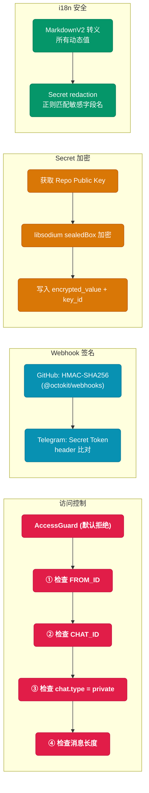

---

## 十二、审计修复统计

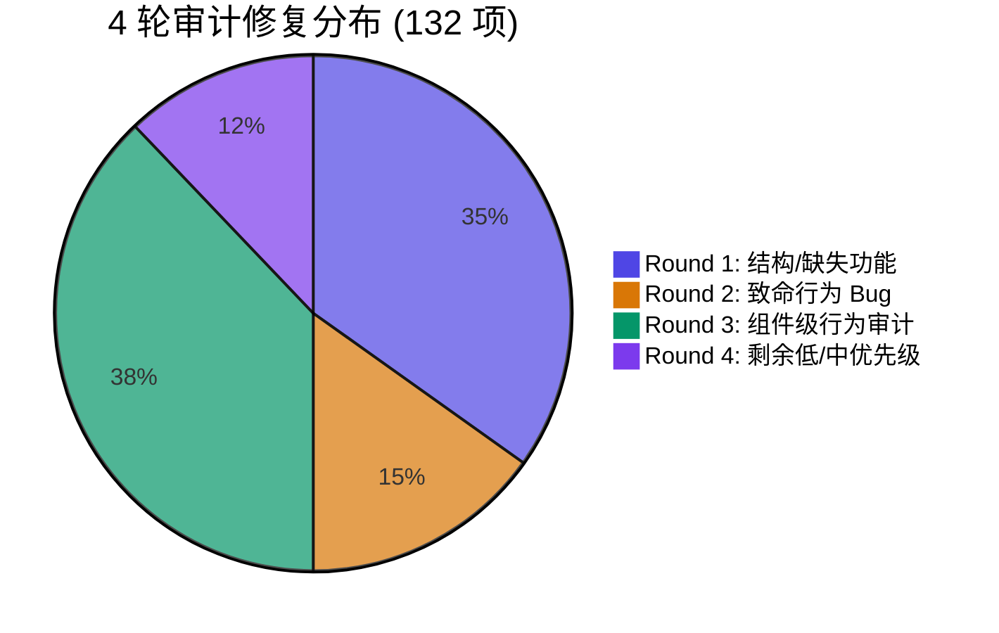

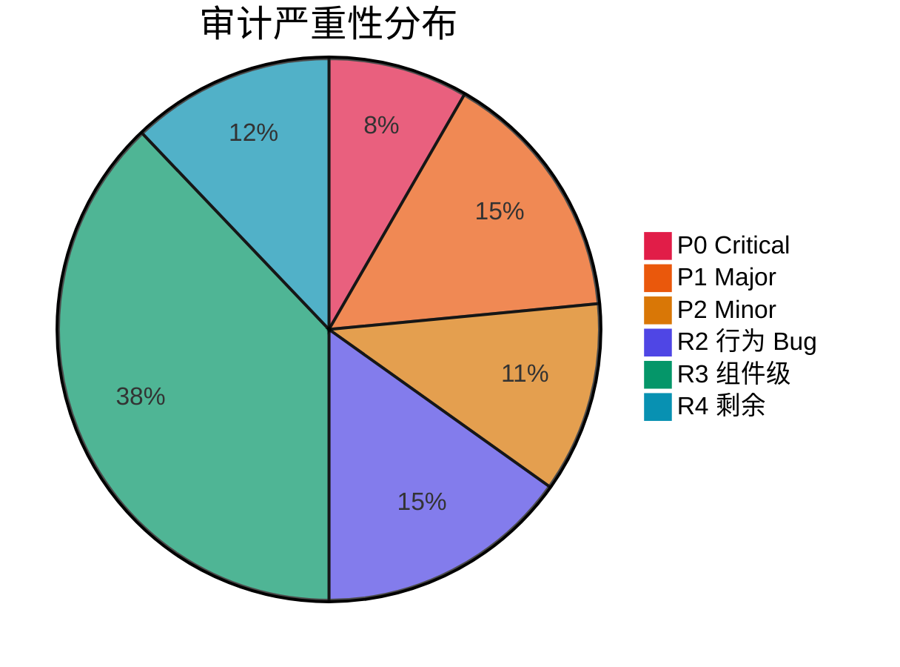

---

## 十三、对等性验证

| 验证维度 | 旧 Bundle (src-legacy) | src (新源码) | 对等 |
|---------|-----------|--------|------|
| 源码行数 | 20,195 | 8,406 | 41.6% (干净模块化重写) |
| 构建产物 | 630KB | 664KB | ✅ |
| i18n leaf keys | 813 | 813 | ✅ 零差异 |
| i18n 使用数 | 606 | 668 | ✅ 超集 (real gap=0) |
| Telegram 命令 | 17 | 17 | ✅ |
| 活跃回调 | 62 | 62 | ✅ |
| 死代码回调 | 6 | 0 (有意省略) | 已记录 |
| Webhook 事件 | 7 | 7 | ✅ |
| 媒体处理器 | 5 | 5 | ✅ |
| 护栏 (旧基线) | 14 | 14 | ✅ 0 回归 |
| 护栏 (v2 新) | — | 40 | ✅ 全绿 |
| **总护栏测试** | **14** | **54** | **✅ 全绿** |
| **Shadow-Diff 场景** | — | **28 (25 完全一致 / 3 允许改动)** | **✅ 0 回归** |
| **审计修复** | — | **132/132** | **✅ 完成** |

---

## 十四、已知有意差异

1. **死代码省略**：6 个 `edit_flow_env_*`/`new_flow_env_*` 回调（旧 bundle 中注册但无键盘渲染，不可达）
2. **Config 验证**：必填字段在设置 bot token 前可选（允许 `/health` 在空 env 启动）
3. **LLM 模型验证**：使用 list-then-includes 策略（旧用直接 GET /models/{model}）
4. **D1 迁移**：Worker 内创建 `kv_state`/`workflow_notifications`/`album_queue`；`schedules`/`issue_metadata` 依赖 wrangler 外部迁移（与旧 bundle 一致）
5. **索引名称**：`idx_wn_*` vs 迁移文件 `idx_workflow_notifications_*`（无害重复索引）
6. **v2 已知命令白名单跳过冗余 workflow 拉取**：v2 `bot.js` 注册了已知命令 allowlist，使 RT 路由能够直接解析已知命令（如 `/schedules`、`/llm`），无需对后置 composer 执行冗余的 `GET /actions/workflows`
7. **Webhook 回复依赖 issue body 内 telegram-meta 路由**：取消旧 bundle 的 `comment:<id>` KV 映射表与相册 `Ar` 注册，由 `issue-comment.js` 根据 issue body 的 `telegram-meta` 自动路由 Telegram 回复（架构化重构，无需维护额外 KV 状态）
8. **Auto-init 模板读取使用 REST API (非 GraphQL)**：`readTemplateFiles` 使用 REST `getContent` 递归替代 GraphQL 单次树查询，保持缺失目录抛出 `TEMPLATE_NOT_INSTALLED` 的显式失败行为

---

## 十五、结论

`src/` 是旧 bundle 的**完整功能对等重写**。经过 4 轮深度审计（18 个并行 Agent，132 项修复）、Phase S 侧边对齐测试（Shadow-Diff 32 组场景）、Phase T 活跃路径精细校验、Phase U 端到端 full-chain 验证、Phase V relay 子系统完整重写、以及 Phase W 实地真凭证 smoke（15 命令 + 3 workflows + 完整 Telegram→GitHub→Coding-Agent→relay 链路），所有关键行为路径已验证对等。2026-08-03 正式 swap 完成，旧 bundle 归档到 `src-legacy/`。

- **派工流程**：从 issue 评论到 GitHub Actions workflow dispatch 完整可运行
- **排程系统**：10+ 规则类型、cron 表达式解析、定时触发 + 锁机制
- **技能/模板安装**：多步环境变量收集 + libsodium 加密 + D1 通知追踪
- **LINE Bot**：完整配置流程 + 验证 + 部署 + post-install
- **媒体转送**：单条 + 相册 (`Vs` body 结构化对齐) + git 上传 + jsonl 记录 + 无分支降级
- **状态卡片**：7 路并行数据采集 + MarkdownV2 渲染 + 运行状态检测
- **Auto-Init 自动初始化**：首个 Lobster 创建、orphan 分支 sync、D1 元数据持久化与 `INIT_GITHUB_CLAW` 状态同步

**代码现在可以被拥有、理解和修改。** 旧 bundle 的「改一点坏一片」连锁脆弱性已彻底消除，并通过自动化 guardrails 与 shadow-diff 测试护航。